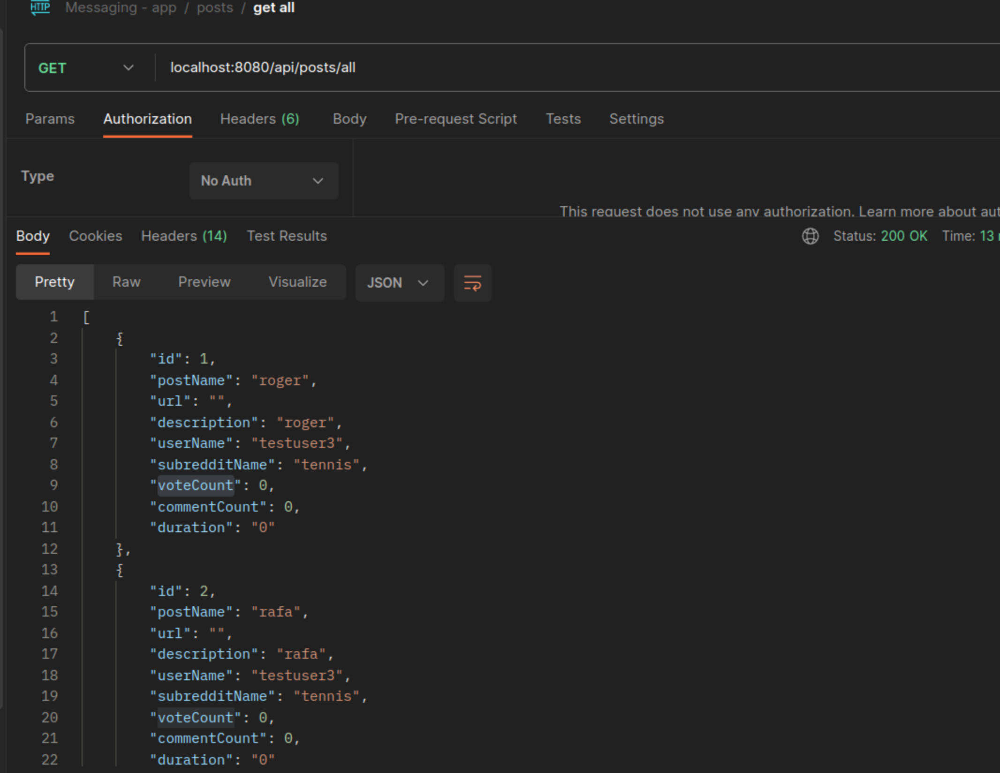
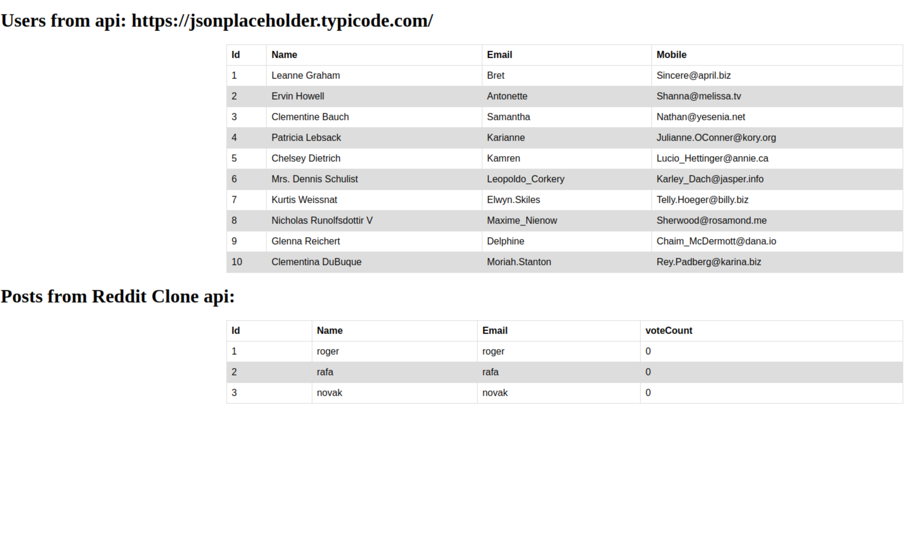

## Angular project handling.

> Generating components & embedding them onto the main view

> Components
> user & my-component
    >> Using a common service (userservice) to fetch users from a third party API: https://jsonplaceholder.typicode.com/
    which are displayed in the root view.
    (app-user)

> Service used in components via dependency injection mechanism.

> Using httpclient module to make a get call from above website. 
> Binding results to display in html component.

### Integrating with a spring boot backend api. 

> Using backend call of 

> Client Output

- [ ] Insert link of reddit api

> Common service created for fetching data from spring boot backend application. Service > postservice. 
