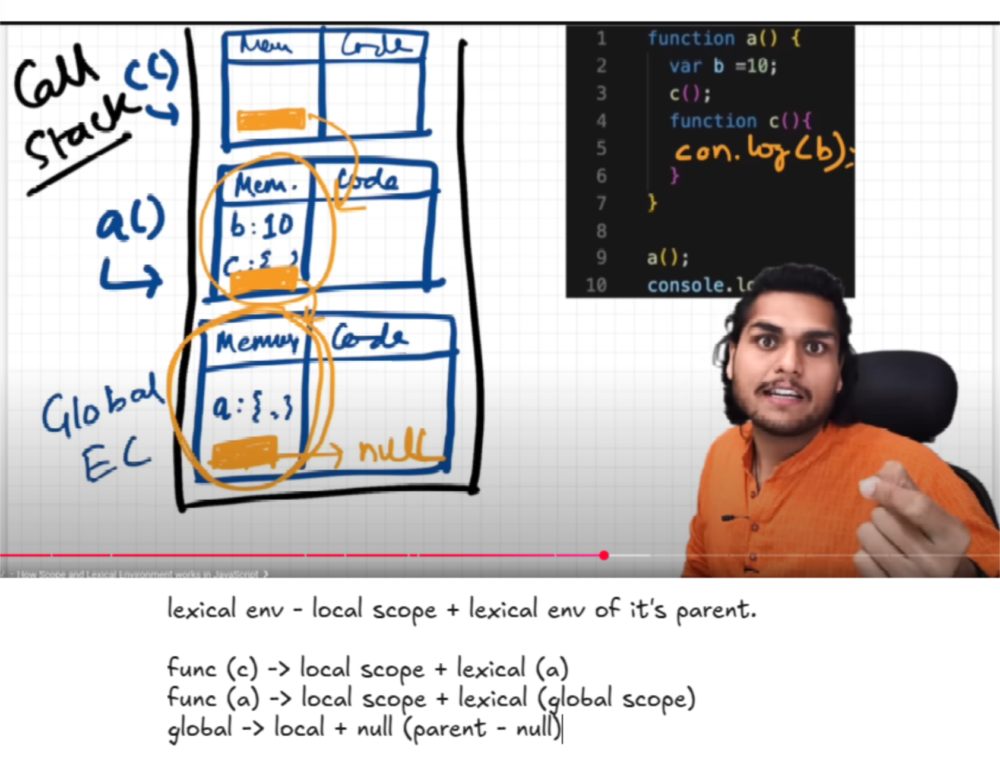
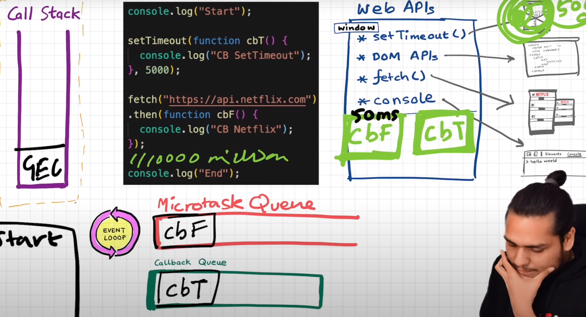

## Javascript Basic Concepts.

- Javascript

  - Everything happens inside a execution context.
  - Execution context : has memory component(also known as variable environment) and code component (thread of execution).
  - memory components stores variables, function as key value pairs.
  - code component - set of code executes line by line.
  - It is synchronous single-threaded language.

- Javascript code execution.
  
- Execution contexts are managed by call stacks.
  - If we observe the left picture, we see that the memory component contains the variables in an undefined state.
  - The function is stored in key value form where key is function name and value is whole function body.
  - There is a global execution context which is in the call stack by default.

#### Hoisting

- Sample:

```
getName(); // prints 'name'
console.log(x); // prints undefined
var x = 10;
function getName(){
  console.log("name");
}
```

- This code will print: undefined and name.
- Should be easy to understand if the memory component and code component concepts are understood.
- These phenomena is called as hoisting - something available before declared.

  - Once execution context is created, we see that getName() is defined in the memory component. So, it is available to be called before it is defined. But, the variable x is not defined in the memory component, so it will print undefined.

- if x is not declared that is (var x = 10) is not present, we will get a <b>ReferenceError</b> as x is not defined.

```
console.log(getName); // prints whole function definition.
function getName(){
  console.log("name");
}
```

- Again this is derived from the concept of memory and code component in execution context.

```
// if the function is defined as a variable,
console.log(x); // prints undefined and not the function body as seen earlier.
var x = function(){...} //

// similar to this.
console.log(x); // prints undefined.
var x = () => {...} //
```

#### Scope chain and lexical environment.

- Scope - where can a variable be accessed.
- Lexical - in hierarchy.
- Lexical env of a function : it's local memory plus lexical environment of it's parent.
- In simple terms, a child will be able to access things locally declared, plus the things declared by it's parents.
- This hierarchial searching in the functions, starting from the child to the it's parent is known as <b>SCOPE CHAIN.</b>



- Types of variable declarations in javascript.

  - we can access variables declared with 'var' keyword before they are declared as they are declared in the global scope.
  - let and const are hoisted but they cannot be used unless assignment because they are not declared in the global scope but a separate scope <b>(SCRIPT/BLOCK)</b>. (They are put in something called as temporal dead zone).

- if user tries to fetch the variable declared by keyword 'let' or 'const' before it is assigned, we get a <b>reference error</b>
- we will also get a reference error if a variable which is not declared is tried to be accessed during the program.
- Syntax error - const is not assigned a value on declaration.
- Type error - const cannot be assigned a value after it is declared.

#### Block, scope and shadowing.

block group of statements.
var is always global, let and const are block scoped.
var will overwrite the global variable even if it is declared inside a block.
let and const are script scoped, so they will not overwrite the global variable.

```
var a =100;
{
    var a = 10; // a shadows the global 'a'
    let b = 20;
    const c = 30;

    console.log(a);
    console.log(b);
    console.log(c);
}
console.log(a); //will print 10
```

- var writes the value in the global scope. It shadows the one in global space.
- If the same was done for let,const, it would print the value defined in global scope.

- Illegal shadowing

```
var a =100;
{
    let a = 10; // a shadows the global 'a'
    {
        const a = 100;
        console.log(a);
    }
    console.log(a);
}

console.log(a);
```

#### Closure:

```
function x()
{
    let a = 10;
    return function y(){
      console.log(a);
    }
}

let z = x();
z();
// even though function y is done execution, it still has access to the variable 'a' from function x.
//This is known as closure.

```
- Function bundled with it's lexical environment.
- Whenever the function is returned, even if it's vanished in execution context but it still remembers the reference it was pointing to. Please note, the reference !! not the value !!

- Function statement & function declaration are used interchangably.
```
function y(){
    console.log('hello y');
}
```
- Function expression.
```
  var b = function (){
  console.log('hello b');
  }
```
- Difference between function statement and function expression is hoisting.
- we can access y before declaring but b will give us an error if accessed before declaring.

f(1,2)
args -> with which a function is called.

params -> function parameters
function f(a,b){
  ...
}


- First Class Function Or First class citizens
- The Ability of use function as value, argument, can be executed inside a closured function & can be taken as return form.

- Callback functions
  - passing functions are arguments to other functions.
  - functions attached to some event, like on click or settimeout time expired.. where the code executes after the time countdown is done.

```
function x() {
    let count = 0;
    const el = document.getElementById("clickhere")
    if(el){
        el.addEventListener("click", function xyz() {
            console.log(count++);
        }, false);
    }
    else{
        console.log("Element not found");
    }

}
window.onload = function(){
    x();
}
```

Above is a call back function with a closure.

### Event loop.

When the timer gets expired for a callback function, the web api's (browser context) or c++ apis in the node context puts the callback function in the callback queue.
Then the EVENT loop puts them into the execution stack.

Same is the case with addEventListener -> when some functionality has to be executed on click. WHen the respective button is clicked, the cb function is put in the callback queue, and then the event loop puts it on the execution stack. 



- mutation observer -> if there is some mutation in the DOM tree, it might run some callback functions. So it also populates the microtask queue.

In the above example, there are 3 things happening

- Code execution.
- Fetch call.
- Callback function with a timer.

  1. Browser has superpowers that are lent to JS engine to execute some tasks, these superpowers include web API's such as console, location, DOM API, setTimeout, fetch, local storage.

  2. Callback functions and event handers are first stored in Web API environment and then transferred to callback queue.
  3. Promises and mutation observer are stored in API environment and then transferred to microtask queue.
  4. Event loop continuously observes call stack and when it is empty it transfers task to call stack.
  5. Micro task is given priority over callback tasks.
  6. Too many micro tasks generated can cause Starvation (nit giving time to callback tasks to execute).

- Javascript Runtime Environment

  - We need one to execute JS.
  - Browsers have it builtin. Other example is nodeJS.

- Tasks done by Runtime Env.

  - Parsing the javascript code to form an AST. (Abstract Syntax Tree)
  - Javascript can execute code using an interpreter or compiler both, most modern browser now support a JIT compilation. which has the ability to interpret and compile the code.
  - After parsing, the interpreter starts interpreting the code line by line, compiler also helps to optimize it, the algorithm to do so may differ engine to engine.
  - After which they go for execution, and where the memory heap and execution stack come into picture.
  - Garbage collector - mark and sweet algorithm.

- Set Timeout, the set timeout will be put in the execution stack only after IT IS EMPTY.
- so , in short it is guaranteed to run after AT LEAST 2 seconds as per the below example.

```
console.log("start")

setTimeout(() => {
    console.log("after 2 seconds")
}, 2000)


var startTime = new Date().getTime();
var endTime = new Date().getTime();
while(endTime - startTime < 10000) {
    endTime = new Date().getTime();
}

console.log("end");
```

promises - to escape the callback hell..

modules vs common

node js by default interprets files as common js file.
to inform nodejs that it should treat the file as module js file, we have to write 'type':'module' in package.json.
if we use module js syntax, we assemble files using import `and export.

- this was done for a couple of reason:
  Standardization: ES6 modules are part of the ECMAScript standard, making them consistent across different environments (browsers, Node.js).
  Static Analysis: ES6 modules allow for static analysis, which can improve tooling (e.g., better code completion, refactoring, and tree shaking).
  Improved Syntax: The import and export syntax is more concise and easier to read.
  Asynchronous Loading: ES6 modules support asynchronous loading, which can improve performance in web applications.
